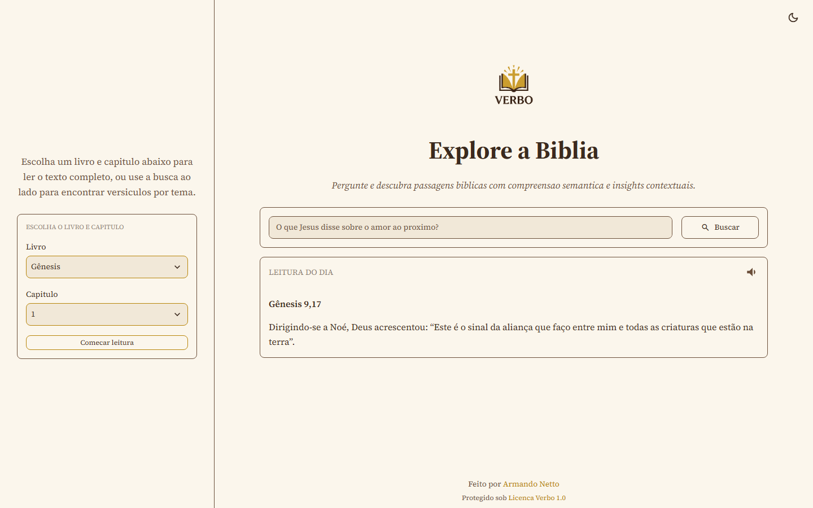
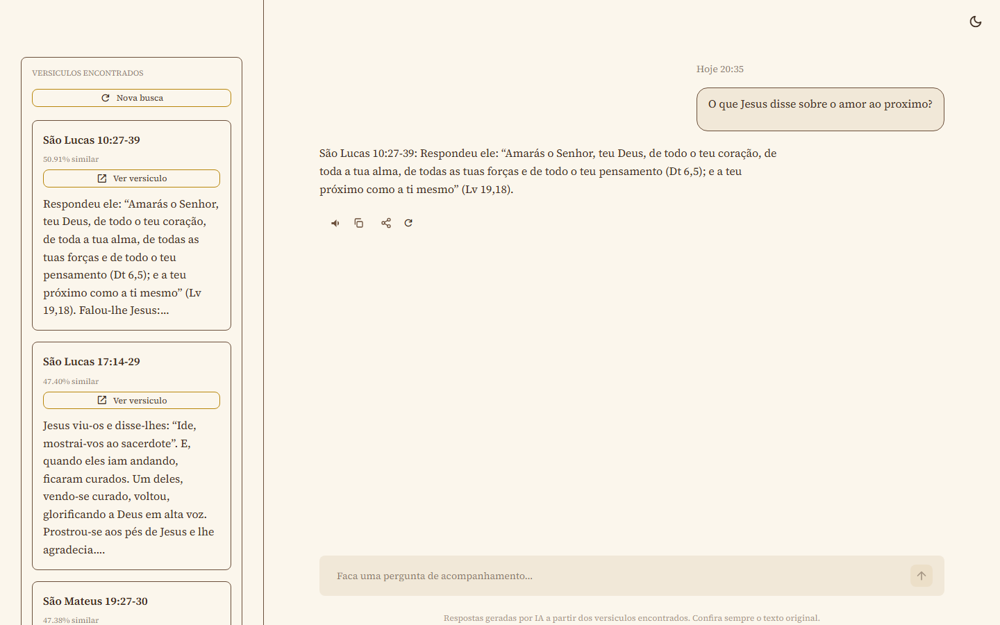
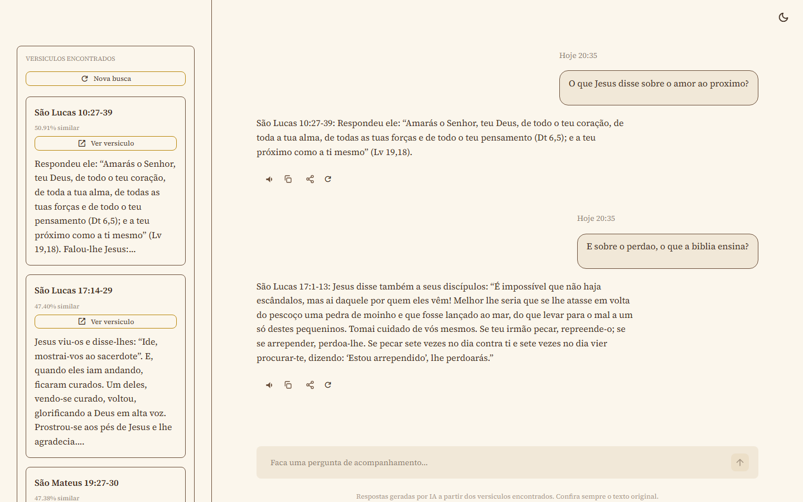
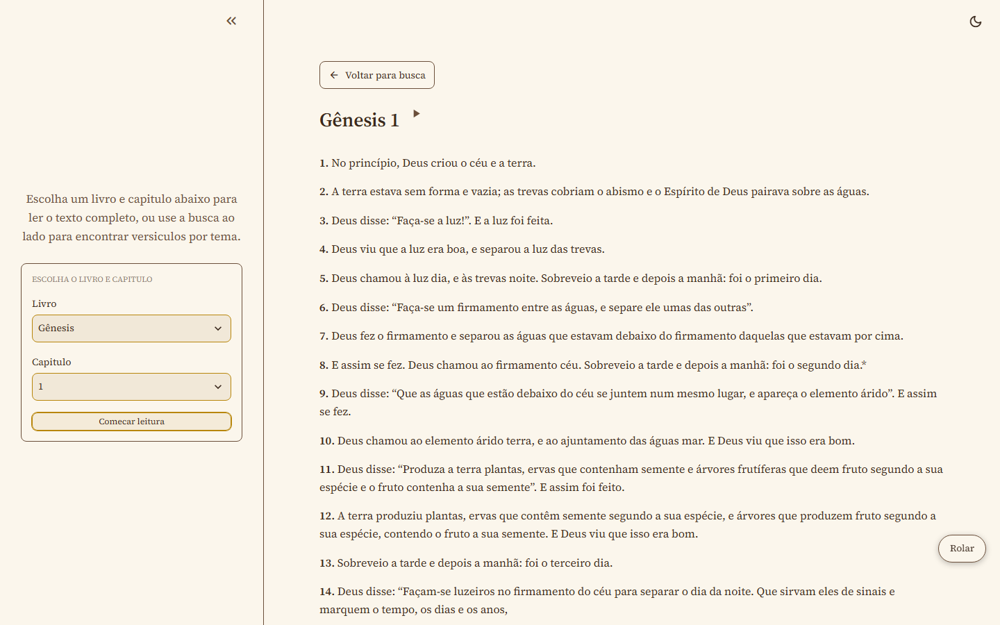
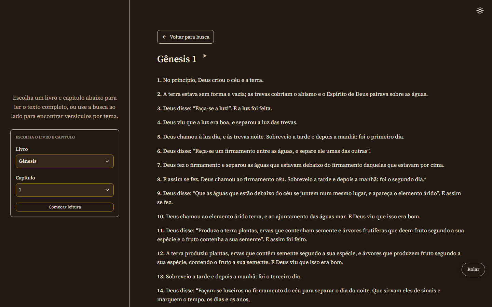
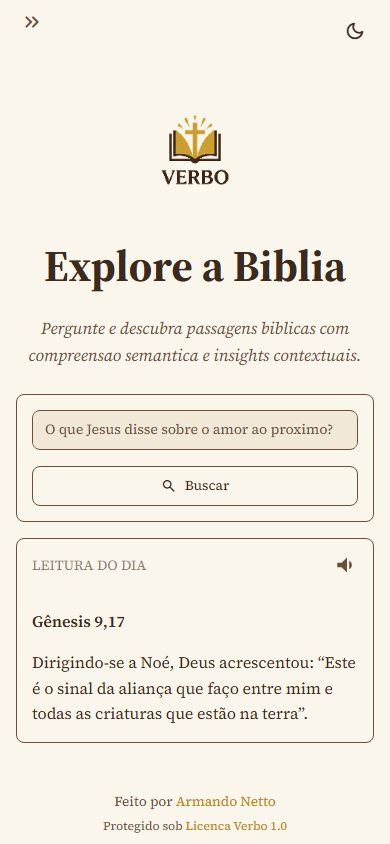

# Verbo

Verbo é um RAG fechado sobre a Bíblia Católica, em português. Responde perguntas usando só o texto da Bíblia como fonte, sem inventar com conhecimento geral do LLM. Projeto público, em produção no Streamlit Community Cloud.

O nome é uma referência a João 1:1, "no princípio era o Verbo".

## Origem

O projeto nasceu de uma necessidade real: durante a preparação para a crisma, surgiu a vontade de ter uma ferramenta que ajudasse a estudar a Bíblia sem o risco de uma IA generalista inventar interpretações. Isso virou a regra central do Verbo — ele só responde com base nos versículos que efetivamente encontra, na tradução escolhida, e diz claramente quando não encontra nada relevante.

## O que o app faz

- **Busca semântica** — pergunta em linguagem natural, resposta sintetizada a partir dos versículos mais próximos por significado (não por palavra-chave)
- **Conversa de acompanhamento** — depois da primeira resposta, dá pra continuar perguntando sobre o mesmo assunto, mantendo o contexto da busca original
- **Leitura completa** — navegação por livro e capítulo, com o texto integral da Bíblia
- **Áudio narrado** — qualquer resposta ou capítulo pode ser ouvido, com barra de progresso na leitura de capítulos
- **Versículo do dia** — um destaque diferente a cada dia, sem repetir enquanto houver versículos novos no ciclo
- **Modo escuro** — alternável, com paleta própria para cada tema
- **Falhas tratadas** — autenticação, limite de uso, conexão ou banco vetorial indisponível mostram uma mensagem clara pro usuário, sem travar a tela

## Capturas de tela

**Tela inicial** — busca semântica e versículo do dia:

**Resultado da busca** — resposta gerada a partir dos versículos encontrados, com as referências na barra lateral:

**Conversa de acompanhamento** — mantém o contexto da busca original:

**Leitura de capítulo completo**, com narração e navegação entre capítulos:

**Modo escuro:**

**Versão mobile:**

## Stack

- Python 3.x
- ChromaDB (banco vetorial local)
- NVIDIA NIM (embeddings + chat completions, free tier)
- Streamlit (interface)
- python-dotenv
- pytest (suite de testes automatizados)

## Fonte dos dados

Bíblia católica, do repositório [`fidalgobr/bibliaAveMariaJSON`](https://github.com/fidalgobr/bibliaAveMariaJSON): 35.450 versículos, 73 livros, UTF-8.

## Como funciona

1. **Indexação (`scripts/construir_banco.py`)** — os versículos são agrupados por capítulo em blocos de até 1.500 caracteres, sem quebrar um versículo no meio, e cada bloco vira um vetor de embedding guardado no Chroma. Agrupar por capítulo (em vez de indexar cada versículo isolado) preserva o contexto ao redor da resposta.
2. **Busca por similaridade** — a pergunta do usuário também vira embedding e é comparada contra os blocos indexados. Os até 40 mais próximos entram na resposta, descartando qualquer um abaixo de 40% de similaridade.
3. **Geração da resposta** — o modelo de chat recebe a pergunta e só os trechos encontrados como contexto, com instrução explícita para não usar conhecimento próprio.
4. **Conversa de acompanhamento** — perguntas seguintes reaproveitam os mesmos versículos e o histórico da conversa, sem nova busca.

A resposta sempre cita a referência (livro e capítulo) dos trechos usados, para que o usuário confira o texto original.

## Começando

- [Instalação](getting-started/installation.md) — ambiente virtual e dependências
- [Configuração](getting-started/configuration.md) — chave da API NVIDIA NIM
- [Rodando](getting-started/running.md) — construir o banco vetorial e iniciar o app

## Referência

- [Arquitetura](reference/architecture.md) — estrutura de módulos e fluxo de uma pergunta
- [Adaptação para outra fonte](reference/adaptation.md) — como reaproveitar a arquitetura para outro texto fixo
- [Erros comuns](reference/troubleshooting.md)
