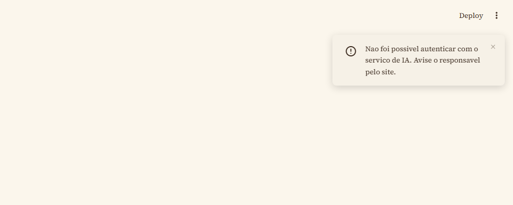
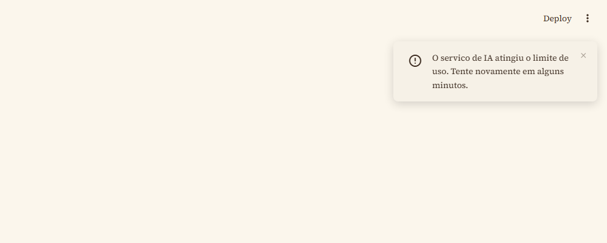
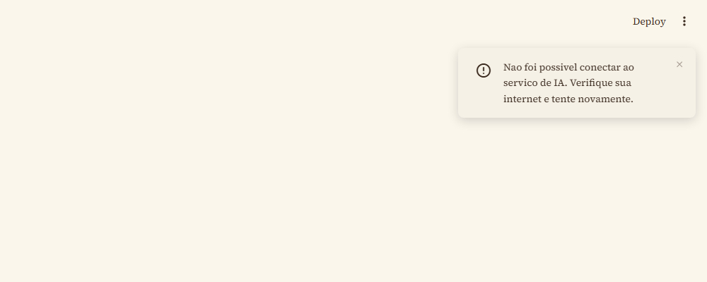
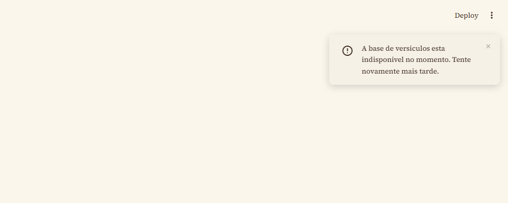
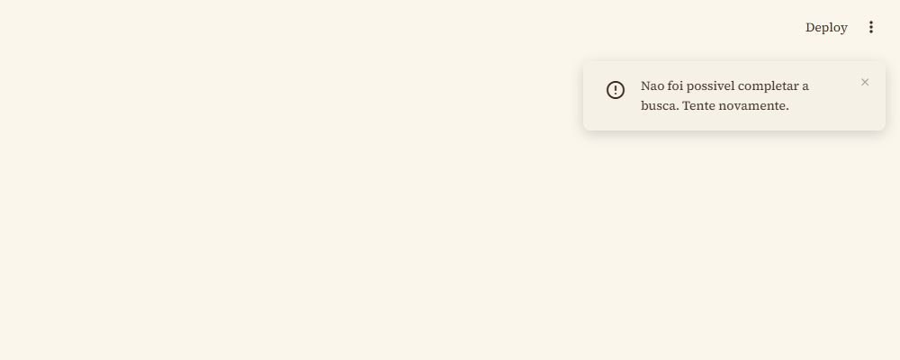

# Erros comuns

## Instalação e configuração

| Erro | Causa | Solução |
|------|-------|---------|
| `FileNotFoundError` | `.secrets/.env` ausente | Copiar `.env.example` para `.secrets/.env` |
| `ModuleNotFoundError` | Dependência faltando | `pip install -r requirements.txt` (e `tests/requirements.txt` para rodar os testes) |
| `FileNotFoundError: biblia.json` | Arquivo não copiado para `data/` | Copiar o JSON para a pasta `data/` |
| `chroma-db/` corrompido ou desatualizado | Mudança na fonte de dados sem reindexar | Apagar a pasta `chroma-db/` e rodar `python scripts/construir_banco.py` novamente |

## Falhas na chamada à API, em tempo de uso

Cada tipo de falha na chamada à NVIDIA NIM ou ao ChromaDB mostra uma mensagem específica pro usuário (`core/erros.py`), sem travar a tela nem expor detalhes técnicos:

**Falha de autenticação** (chave inválida ou ausente):

**Limite de uso da API atingido:**

**Falha de conexão:**

**Banco vetorial indisponível:**

**Qualquer outra falha:**

## Quando o servidor cai

Se a conexão com o servidor do Streamlit cai (deploy em andamento, processo reiniciando, etc.), a interface passa a mostrar os campos desabilitados e um ícone de sem-conexão no botão de busca, em vez de travar sem explicação:

Esse é o comportamento padrão do Streamlit ao perder o websocket com o servidor — a página tenta reconectar automaticamente quando o servidor volta.
